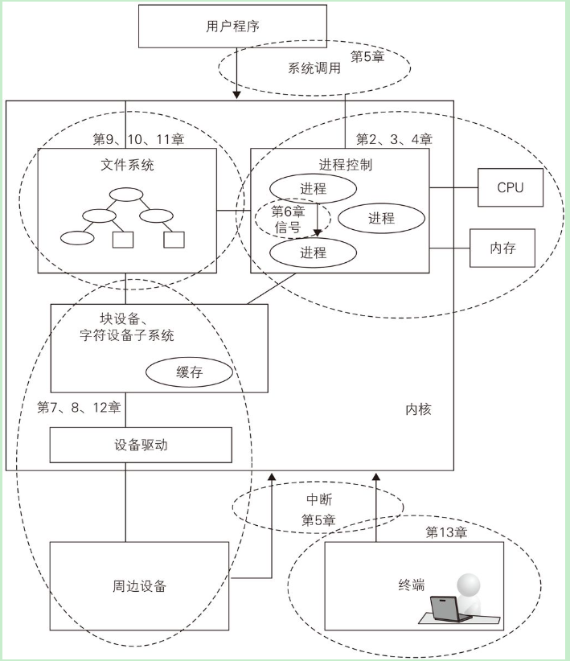
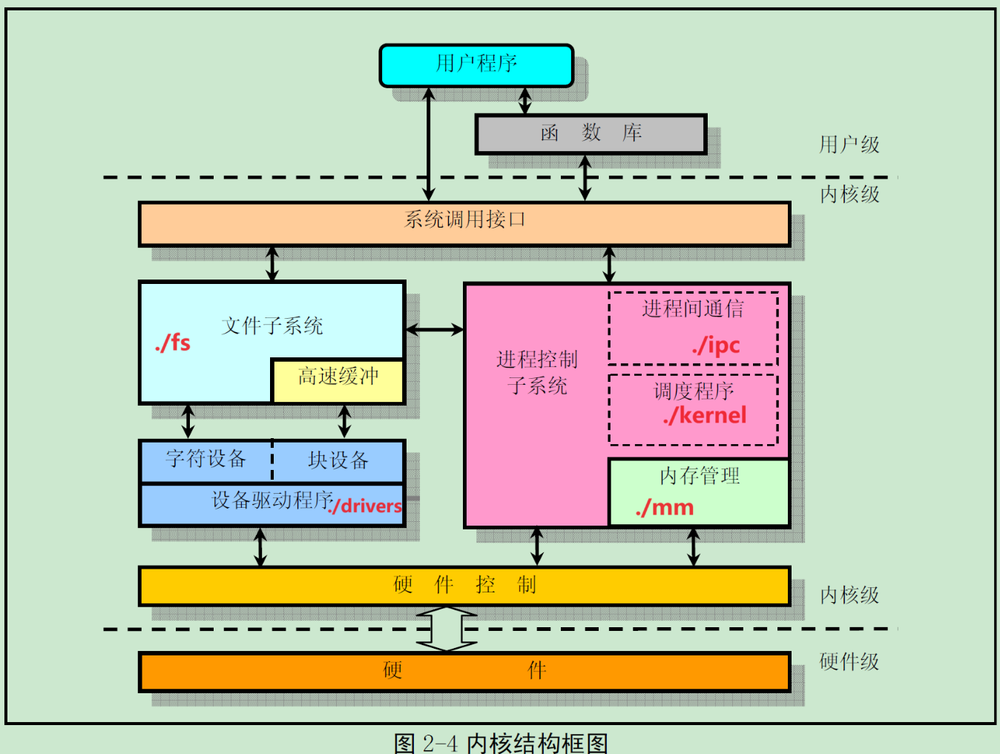

# linux-reading

- https://github.com/mit-pdos/xv6-riscv
- unix: https://pages.lip6.fr/Pierre.Sens/srcv6/
- https://mirrors.edge.kernel.org/pub/linux/kernel/

~~~
.
|-- COPYING
|-- CREDITS
|-- Documentation
|-- MAINTAINERS
|-- Makefile
|-- README
|-- REPORTING-BUGS
|-- Rules.make
|-- arch
|-- drivers    # 设备驱动程序
|-- fs  # 文件系统
|-- include
|-- init
|-- ipc  # 进程间通信
|-- kernel   # 调度
|-- lib
|-- mm    # 内存管理
|-- net
`-- scripts

~~~