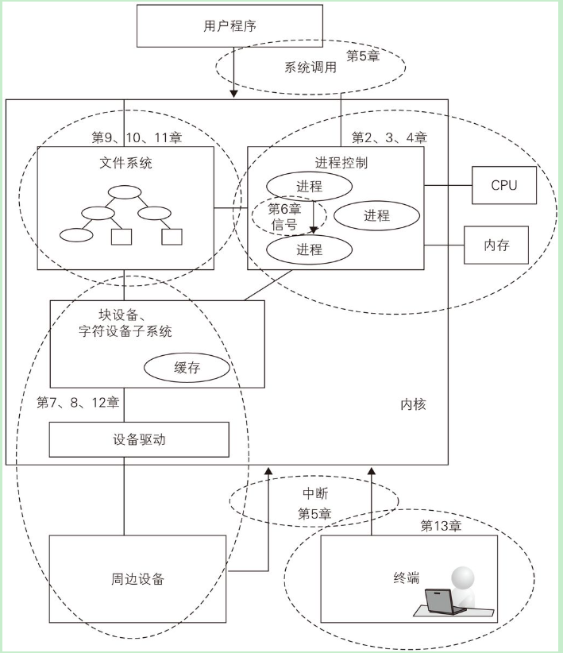

# linux-reading

- https://github.com/mit-pdos/xv6-riscv
- unix: https://pages.lip6.fr/Pierre.Sens/srcv6/
- https://mirrors.edge.kernel.org/pub/linux/kernel/

## unix 

xv6 启动：
[编译运行xv6（环境搭建）](https://codesimp1e.github.io/cao-zuo-xi-tong/6-s081/2023/06/19/6-s081-1/)

~~~
cd xv6-riscv
make qemu

.........
qemu-system-riscv64 -machine virt -bios none -kernel kernel/kernel -m 128M -smp 3 -nographic -global virtio-mmio.force-legacy=false -drive file=fs.img,if=none,format=raw,id=x0 -device virtio-blk-device,drive=x0,bus=virtio-mmio-bus.0

xv6 kernel is booting

hart 1 starting
hart 2 starting
init: starting sh
$
~~~

## linux

~~~
.
|-- COPYING
|-- CREDITS
|-- Documentation
|-- MAINTAINERS
|-- Makefile
|-- README
|-- REPORTING-BUGS
|-- Rules.make
|-- arch
|-- drivers    # 设备驱动程序
|-- fs  # 文件系统
|-- include
|-- init
|-- ipc  # 进程间通信
|-- kernel   # 调度
|-- lib
|-- mm    # 内存管理
|-- net
`-- scripts

~~~